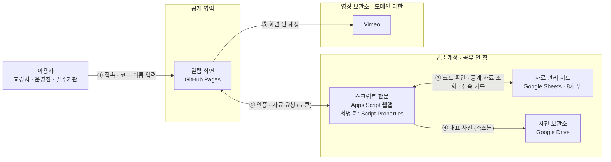
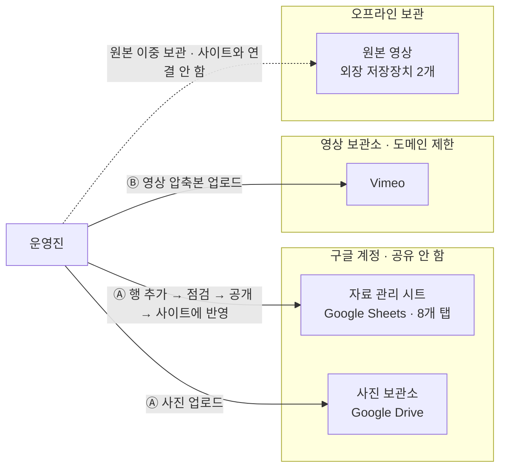

# 시스템 구성

> 원본 다이어그램: `docs/architecture.drawio` (draw.io로 열 수 있음)
> 화살표 방향은 **요청 방향**이다. 응답은 반대로 돌아온다.

---

## 1. 구성 요소

| 구성 요소 | 위치 | 역할 |
|---|---|---|
| 이용자 | — | 교강사 · 운영진 · 발주기관. 접근코드와 이름으로 들어온다 |
| 열람 화면 | GitHub Pages | 일정표와 자료 목록을 표시한다. 자료를 보관하지 않고 화면 구성만 담당한다 |
| 스크립트 관문 | Google Apps Script 웹앱 | 접근코드를 확인한 뒤에만 자료를 내보낸다. 서명 키는 Script Properties에 둔다 |
| 자료 관리 시트 | Google Sheets (8개 탭) | 일정·자료·참여자·접근코드·로그를 기록한다. 공유하지 않는다 |
| 사진 보관소 | Google Drive | 사진을 보관한다. 공유하지 않는다. 대표 사진은 관문을 거쳐 축소본으로 전달된다 |
| 영상 보관소 | Vimeo | 1080p 압축본을 비공개로 보관한다. 도메인 제한으로 이 사이트 밖에서는 재생되지 않는다 |
| 운영진 | — | 시트에 행을 추가하고, 사진과 영상을 올린다 |
| 원본 영상 | 외장 저장장치 2개 | 원본을 이중 보관한다. **사이트와 연결하지 않는다** |

---

## 2. 묶음

| 묶음 | 포함 | 성격 |
|---|---|---|
| 공개 영역 | 열람 화면 | 주소와 코드가 공개된다고 가정한다 |
| 구글 계정 · 공유 안 함 | 스크립트 관문 · 자료 관리 시트 · 사진 보관소 | 관문을 거치지 않으면 접근할 수 없다 |
| 영상 보관소 · 도메인 제한 | Vimeo | 이 사이트를 경유하지 않으면 재생되지 않는다 |
| 오프라인 보관 | 원본 영상 | 사이트와 연결하지 않는다 |

---

## 3. 열람 흐름

| 번호 | 구간 | 내용 |
|---|---|---|
| ① | 이용자 → 열람 화면 | 접속, 코드·이름 입력 |
| ② | 열람 화면 ↔ 관문 | 인증, 자료 요청 (토큰) |
| ③ | 관문 ↔ 시트 | 코드 확인, 공개 자료 조회, 접속 기록 |
| ④ | 관문 → 드라이브 | 대표 사진 (축소본) |
| ⑤ | 열람 화면 → Vimeo | 화면 안 재생 |

**요점**

- 열람 화면은 시트·드라이브에 직접 닿지 않는다. 모든 자료는 ②③④를 거친다.
- 관문은 요청마다 토큰과 공개여부를 다시 확인하고, 공개여부가 `공개`인 자료만 내보낸다.
- ⑤만 열람 화면이 외부로 직접 나간다. 이때 보호는 Vimeo의 도메인 제한이 담당한다.

---

## 4. 관리 흐름

| 번호 | 구간 | 내용 |
|---|---|---|
| Ⓐ | 운영진 → 시트 | 행 추가 → 점검 → 공개 → 사이트에 반영 |
| Ⓐ | 운영진 → 드라이브 | 사진 업로드 |
| Ⓑ | 운영진 → Vimeo | 영상 압축본 업로드 |
| — | 운영진 ↔ 원본 영상 | 외장 저장장치 2개에 이중 보관. 사이트와 연결하지 않는다 |

**요점**

- 담당자는 시트에 행을 추가하는 것만으로 화면을 갱신한다.
- [사이트에 반영]을 누르지 않아도 10분 안에 반영된다.
- 원본 영상은 어떤 흐름에도 연결되지 않는다. 점선은 보관 관계만 나타낸다.

---

## 5. 교체 가능성

| 항목 | 방식 | 효과 |
|---|---|---|
| 관문 응답 형식 | `{ ok, error, data }` 고정 | 관문을 다른 백엔드로 바꿔도 화면 코드를 고치지 않는다 |
| 영상 서비스 | 시트 「설정」 탭의 값으로 선택 (기본 Vimeo) | Bunny Stream 등으로 교체 가능하다 |

---

## 6. 원본 파일

- `docs/architecture.drawio` — 이 문서의 근거가 되는 구성도 원본. 수정 시 이 문서도 함께 고친다.
